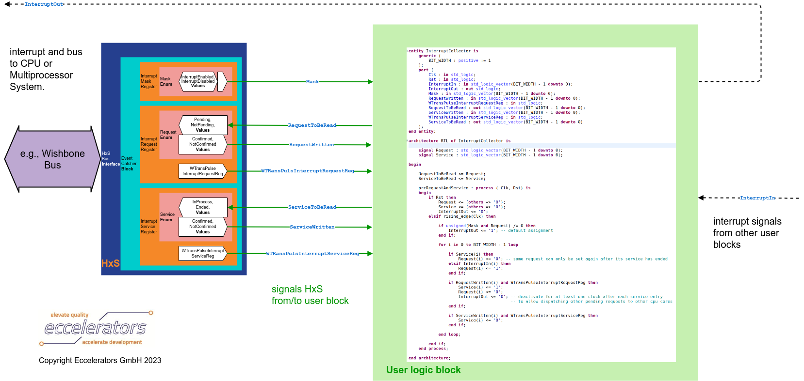
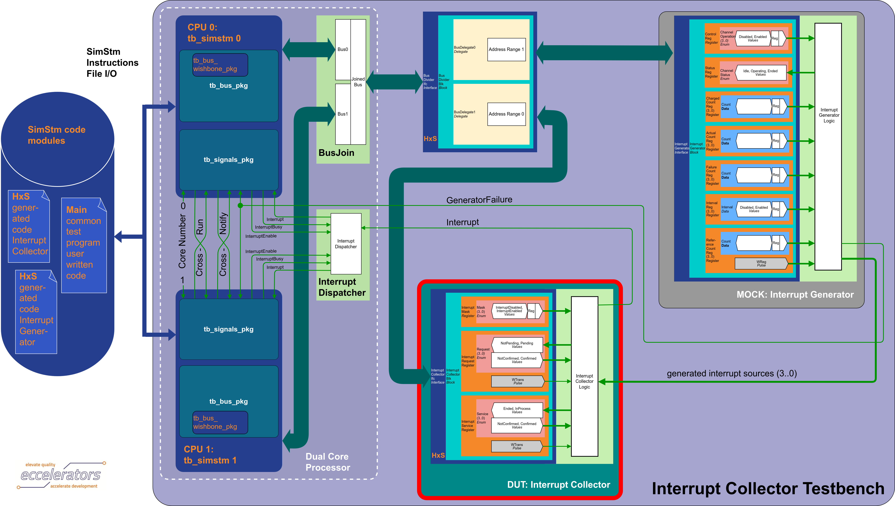
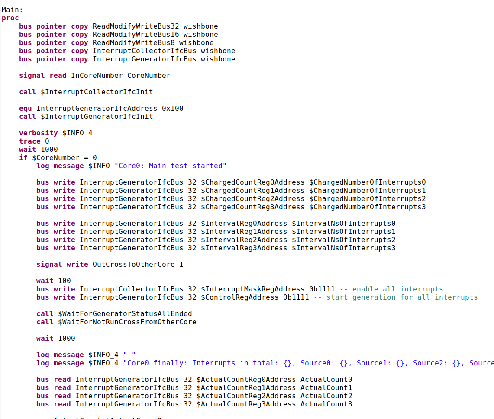

Interrupt Collector
===================

.. contents:: 
   	:depth: 3
	
<<<<<<< HEAD
.. include:: ./src/rst/InterruptCollectorIfc_usage.rst
=======
.. inclusion-marker-do-not-remove

**Introduction**
----------------

Interrupts connect software (SW) and hardware (HW) very closely. They require a carefully planned concept that starts from the HW source bit, which 
causes an interrupt event, through different HW controllers/collectors located both outside and inside a CPU system, and extends to 
the SW operating system and its drivers, up to the application software. The concept is dependent on the specific nature of all components 
in this chain and dramatically affects the real-time capabilities and overall performance of a system.

A designer of a peripheral logic block for a CPU system is often required to issue an interrupt to the system if their logic needs attention from the CPU. 
Typically, there is more than one event source in the peripheral logic block that can trigger an interrupt. 
The *Interrupt-Collector* presented here is a proven solution for managing these tasks. It does not impose excessive overhead on a peripheral logic block 
for a tiny microcontroller and is suitable for the most complex systems on a chip (SOC) with multiple cores running in symmetric or asymmetric multiprocessing mode. 
Thus, it and its driver software can be reused across a wide range of designs.

The description of the *Interrupt-Collector* in the subsequent chapters is structured in a top-down manner, starting from a testbench that includes it, 
and progressing to its internal functions.

The testbench simulation can be run immediately with either the GHDL or ModelSim simulator using the included ANT scripts. For more information, 
see the :ref:`Quick Start` section.

The VHDL source code, along with other source code in this repository, can be used liberally under the MIT license for any design.

Functionality
-------------

The distinctiveness of the Interrupt-Collector is evident in the type of interrupt sources it can manage. 
It is specifically designed for level-triggered interrupt sources, meaning the interrupt stays active as long as 
the trigger event or signal condition persists. This is in contrast to edge-triggered sources, which initiate an 
interrupt due to a change in the signal state, like transitioning from low to high or vice versa.

For systems employing edge-triggered sources, Eccelerators presents an additional solution – the *Event-Catcher*. 
This IP block is capable of transforming edge-triggered sources into level-triggered sources, thereby ensuring 
compatibility with the Interrupt-Collector. 

The interrupt collector consists of two parts. The first part, the hardware-software interface, is generated by the Eccelerators Tool HxS. 
It uses the description of the Mask-, Service- and Request, Registers in the HxS language as input. The output is the complete implementation 
of these registers in VHDL, with the necessary inputs and outputs to a user logic block. 
The second part contains the logic of the interrupt collector function, coded by the user.

The design allows for the simultaneous processing of different interrupts within the same interrupt collector by multiple 
processors of a multiprocessor system, without the need for additional synchronization measures such as Spin-Locks.

The accompanying diagram illustrates the implementation, including the connection of the HxS block to a Wishbone bus leading 
to the CPU or the multiprocessor system. The User Block demonstrates the realization of the interrupt logic. 
Both blocks are scalable in terms of the number of serviced interrupt inputs.

   
   Interrupt Collector Overview

Upon the arrival of an interrupt event at an input, an interrupt is triggered to the CPU system. 
This leads to the execution of an interrupt routine by software on exactly one CPU of the system. The routine reads the *Request-Register*
in the interrupt collector, selects one of the reported interrupt requests for processing, and acknowledges 
this by setting the corresponding bit in the Request-Register. 
This interrupt request is then reset in the Request-Register and appears in the *Service-Register*. After completing the tasks in the interrupt 
service routine, the CPU sets to the corresponding bit in the Service-Register, thereby signaling the end of the interrupt routine 
to the interrupt collector. Only from this point can the corresponding Request-Register bit be set again by the same interrupt input.

The actual triggering of an interrupt to the CPU system can be enabled or disabled in the *Mask-Register* for each input. 
After each acknowledged request, the interrupt line to the CPU system is briefly deactivated to allow for the processing 
of further interrupts by other CPUs of the system. 

The priority and synchrony of the individual interrupt inputs can be adjusted by the user in the User-Logic.

Testbench
---------

   
   Interrupt Collector Testbench

The "Interrupt Collector Testbench" shows the Device Under Test (DUT), our Interrupt
Collector, within the red-bordered block. On the left are two processors, simulating a
multiprocessor system. Each is an instance of the "Eccelerators SimStm Testbench".
Both execute the same SimStm code, shown on the left. The main routine differentiates
based on core number; Processor 0 manages initial processes and cross-run signals for
Processor 1. Only Processor 0 performs the DUT and mocks' initialization. 

The Wishbone buses from both processors merge via a bus join unit, forming the common
bus connection of the system. The bus then splits again into two address areas: one for the DUT
and another for the mock, using a block generated by HxS with two delegates. 

The mock includes an interrupt generator creating four programmable interrupts. Each interrupt
must be acknowledged in the generator by reading the actual count register and writing its count
to the reference count register. Missed or incorrect acknowledgments are recorded per issued 
interrupt in an failure count register. The generator signals an failure at the first fault 
via its "GeneratorFailure" output.

The four interrupts generated by the Interrupt Generator are processed by the DUT, the Interrupt Collector. 
They are delivered to the entire processor
system via its "Interrupt" output. These interrupts are evenly distributed across both
processors by the Interrupt Dispatcher.

A short glance at the SimStm program "Main" routine snippet.

   
   SimStm Main Routine Snippet

Simulation
----------

General
:::::::

In this article, we focussed on an individual IP component rather than a complete
FPGA design. Consequently, instead of creating a bitstream, we employ GHDL or ModelSim for
simulation purposes. Our IP is simulated using the SimStm framework, a tool we
developed for simulation and testing.

To begin with, we utilize the register description to generate various HxS artifacts,
including the VHDL register interface and its documentation. For this process,
we've set up a Linux environment, specifically using Ubuntu 22.04. The first step
involves installing Ant.

.. code-block:: BASH

  sudo apt-get install ant -y

Next, we clone the actual `interrupt-collector <https://github.com/eccelerators/interrupt-collector>`_
repository:

.. code-block:: BASH

  git clone --recurse-submodules git@github.com:eccelerators/interrupt-collector.git
  
  
HxS sources are now in the hxs folder `hxs <https://github.com/eccelerators/interrupt-collector/tree/main/hxs>`_  folder of the clone.

We generate the HxS artifacts if having a valid HxS-license or Evaluation license:

.. code-block:: BASH

  cd interrupt-collector
  ant all
  
Otherwise we use the artifacts already present in the `src-gen folder <https://github.com/eccelerators/interrupt-collector/tree/main/src-gen>`_

GHDL
:::::::

Assuming GHDL(4.0.0 or later) is already installed, to simulate the design we run:

.. code-block:: BASH

  cd interrupt-collector/simulation/ghdl-wishbone
  ./run.sh

A successful simulation will yield an output similar to this:

.. code-block:: TEXT

  ...
  
  Core1 currently: Interrupts in total: 0x0360, Source0: 0x0142, Source1: 0xEE, Source2: 0xB3, Source3: 0x7D 
  Core0 currently: Interrupts in total: 0x0380, Source0: 0x013E, Source1: 0xFF, Source2: 0xC0, Source3: 0x83 
  Core1 currently: Interrupts in total: 0x0380, Source0: 0x0142, Source1: 0x0101, Source2: 0xC0, Source3: 0x7D 
 
  Core1 finally: Interrupts in total: 0x0380, Source0: 0x0142, Source1: 0x0101, Source2: 0xC0, Source3: 0x7D 
  Core1: test finished
 
  Core0 finally: Interrupts in total: 0x0380, Source0: 0x013E, Source1: 0xFF, Source2: 0xC0, Source3: 0x83 
 
  Total counts finally: ActualSum: 0x0700, Actual0: 0x0280, Actual1: 0x0200, Actual2: 0x0180, Actual3: 0x0100 
  Total failure count finally: FailureSum: 0x00, Failures0: 0x00, Failures1: 0x00, Failures2: 0x00, Failures3: 0x00 
 
  Core0: Main test finished
 
  ../../../submodules/simstm/src/tb_simstm.vhd:1245:21:@773216100ps:(assertion note): test finished with no errors!!
  ./work/tb_top_wishbone:info: simulation stopped by --stop-time @9990391400ps

ModelSim
:::::::

Assuming ModelSim is already installed, to simulate the design we run:

.. code-block:: BASH

  cd interrupt-collector/simulation/modelsim_wishbone
  ant all
  
Possibly the path to the ModelSim executable may have to be adapted in the ant build.xml file.
  
In the ModelSim window command line section we run:
  
.. code-block:: TEXT

  run -all

Using ModelSim Starter edition it may take up to 5 minutes until the output of a successful simulation 
will yield like this: 

A successful simulation will yield an output similar to this:

(ModelSim Starter edition will take already a very long time cause of design size)

.. code-block:: TEXT

  ...
  
  # Core0 currently: Interrupts in total: 0x0380, Source0: 0x013E, Source1: 0xFF, Source2: 0xC0, Source3: 0x83 
  # Core1 currently: Interrupts in total: 0x0380, Source0: 0x0142, Source1: 0x0101, Source2: 0xC0, Source3: 0x7D 
  #  
  # Core1 finally: Interrupts in total: 0x0380, Source0: 0x0142, Source1: 0x0101, Source2: 0xC0, Source3: 0x7D 
  # Core1: test finished
  #  
  # Core0 finally: Interrupts in total: 0x0380, Source0: 0x013E, Source1: 0xFF, Source2: 0xC0, Source3: 0x83 
  #  
  # Total counts finally: ActualSum: 0x0700, Actual0: 0x0280, Actual1: 0x0200, Actual2: 0x0180, Actual3: 0x0100 
  # Total failure count finally: FailureSum: 0x00, Failures0: 0x00, Failures1: 0x00, Failures2: 0x00, Failures3: 0x00 
  #  
  # Core0: Main test finished
  #  
  # ** Note: test finished with no errors!!
  #    Time: 773216100 ps  Iteration: 0  Instance: /tb_top_wishbone/i0_tb_simstm
  # ** Note: Leaving proc Main and halt at line 195 end_proc file ../../tb/simstm/TestMainWishbone.stm
  #    Time: 1000790207100 ps  Iteration: 0  Instance: /tb_top_wishbone/i1_tb_simstm

HxS - Hardware/Software interface
---------------------------------

The Hardware/Software interface description of the Interrupt-Collector generated by HxS is: `file <https://github.com/eccelerators/interrupt-collector/tree/main/src-gen/rst/Eccelerators.Library.IP.InterruptCollectorIfc-composite.rst>`_.  

The respective HxS sources are found in the `hxs <https://github.com/eccelerators/interrupt-collector/tree/main/hxs>`_  folder of the interrupt-collector clone.
  
Further generated artifacts Vhdl, SimStm, C, Python, HTML-Documentation, and PDF-Documentation is placed in `hxs <https://github.com/eccelerators/interrupt-collector/tree/main/src-gen>`_  folder.

The same applies for the Interrupt-Generator of the Mock and can be found the respective submodule folder.

A glance at the HxS source snippet of the Interrupt Request Register:

.. figure:: src/rst/resources/HxsRegisterSnippet.png
   :scale: 50
   
   HxS Interrupt Request Register Snippet
  

Conclusion
----------

Overall, the Interrupt-Collector is a testament to the advanced technological 
strides in the realm of computer hardware, pivotal in crafting more efficient and adaptable 
computing systems. 

Innovations like these are crucial to the evolution of fields such as embedded systems. 
The Interrupt-Collector's code is available under an MIT license. 

**Feel free to use it—there's no need to reinvent the wheel!**
>>>>>>> 0178773 (advance)
